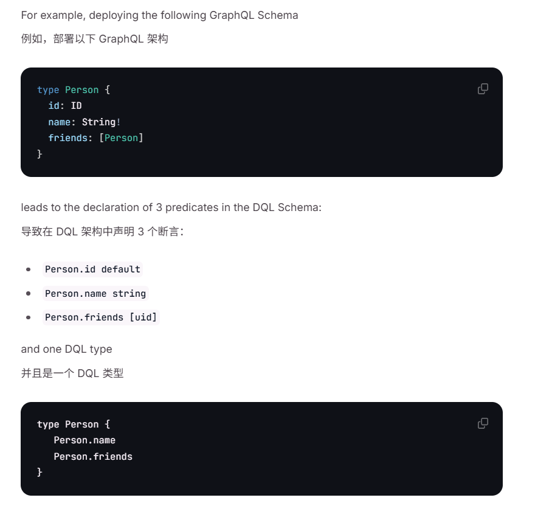

## ZZL写在最前：
### 优化点
  - 已知Dgraph不是按照子图分片的，而是按照谓词来分片的，那么将一些相关的谓词（查询的时候经常一起查询的，或者是新增的时候记录该结构体，并依此进行分片的选服务器存储操作）记录起来，然后挪动到同一台服务器里面（在空闲时间）
  - 

### (1) Dgraph如何从源码构建运行环境，以方便DEBUG？Dgraph如何与修改的Badger联系起来？  
  首先VSCODE先下载好GO语言的工具包，详见https://blog.csdn.net/weixin_44387339/article/details/131633127  
  然后点击VSCODE左侧调试，分别本地运行alpha与zero即可（默认已经配置好端口号了），然后打断点，并在ratel里发送请求测试就行  
  当前ratel地址 [192.168.80.128](http://192.168.80.128:8000/?latest)  
  当前zero地址 http://192.168.80.128:8080  
  
###  (2) Dgraph的一些需要关注点  
  - 2.1 一些英语单词对照  
      - predicate 谓词  
      - Schema 模式  
      - facet 方面（在Dgraph中，常表示关系（即边）自身的属性，如权重，时间范围等）  
  - 2.2 谓词实际就是JSON格式中的左侧,有时也叫relationship（关系），或者边  
      右侧叫宾语（所以可以是字面值（literal values）也可以是另一个节点或节点数组（此时左侧谓词也叫关系relationship））  
      所属对象（节点）则可以叫为主语  
  - 2.3 有关Schema  
      -  Dgraph 维护了一个包含所有谓词名称及其类型和索引的 Dgraph 类型 schema 列表，而schema定义节点的结构体，提供数据的结构化定义。  
        具体来说的话，Schema会定义底层三元组中谓语指向的宾语是什么节点类型又或者是什么具体类型的字面量，而且Schema也会定义在哪个谓语中需要定义索引  
      -  即Schema内主要包含的就两个东西，一个是谓词（predicates，类似对象的一个属性的K，但是该属性可以脱离对象进行自连接，默认追加数据的都是添加的这个）  
         一个就是节点类型（Types 节点类型里面包含一到多个谓词，类似面向对象里面的对象 ） 
      -  注意代码里面的Predicates与Types只有进行查询schema本身的时候才会有数据，普通的查询各种数据，是为空的
      -  GraphQL与DQL的区别看4.5  
  - 2.4 默认 Dgraph图中的关系（边）是有向的，即其是单向边  
        DQL的可以在谓词声明的时候，加上@reverse，以方便可以在查询的时候可以用～来查找指向当前节点的节点和属性（默认查找是找当前节点指向的节点和属性  ）
        Grapfh QL可以用@hasInverse来告诉Dgraph如何处理双向关系，具体看官方文档 relationships 的内容  
  - 2.5 Dgraph支持自定义查询语句 详见文档的Custom DQL  
  - 2.6 Dgraph 按关系（谓词）分片数据，因此一个关系的数据形成一个单独的分片，并存储在一个（组）服务器上，这种做法被称为“谓词分片”（节点是隐含在谓词存储中）。这样可以在一台服务器上面就可以进行连接操作，然后能够向其他服务器进行少次数的RPC请求（因为相较于内外存，网络明显更慢！）便可得到完整所需的数据。
        一个tablets（平板）对应一个单一谓词存储，且对应一个分片（官网说未来可能也支持一个tablets再划分为多个分片）  
        且Zero会根据每个组的磁盘使用情况来自动均衡集群(默认每10分钟自动进行)，在平衡分布时，被移动的谓词会变为只读状态，突变将会全部拒绝。  
  - 2.7 聚合查询同学数据库的那个聚合函数，就是做统计的
  - 2.8 Dgraph对于谓词的使用模式有两种  
        在 strict 模式下，您必须先声明谓词（更新 Dgraph 类型），然后才能使用这些谓词运行突变。  
        在 flexible 模式（默认行为）下，您可以在不声明 DQL 模式中的谓词的情况下运行突变，按照突变的自动生成模式的类型。  
  - 2.9 NOTE:重要！！！ 有关数据库调试及运行状态查看的，该点详见官方文档的 Administration-Observablity的Metrics（看有何种统计及运行信息）以及Debugging（如何看各种统计运行信息以及一些其他的调试工具）  
        - 2.9.1 Dgraph自带debug功能，在请求的url后加上debug=true的话，就会在返回的时候在server_latency内加上解析花费时间，处理花费时间以及编码花费时间，此外还有txn的start ts  
        - 2.9.2 而有关服务器当前运行状态的可以看官方文档的 Administration-Observablity-Metrics的内容，有关Raft，Badger，Dgraph的各种指标都有，很方便！！！！
        - 2.9.3 每个 Dgraph 数据节点通过 /debug/pprof 端点公开配置文件，通过 /debug/vars 端点公开指标（指标不存储，仅能进行即时查看）。 可以通过轮询这两个端口来监控状态 或者 通过Prometheus + Grafana（图形化展示）来监控 
        - 2.9.4 另外，Dgraph 与 OpenCensus 集成，可以收集Dgraph集群的分布式跟踪信息  
  - 2.10 NOTE:重要！！！ 每个组内构成一个RAFT应用环境，即每个组内均有一个leader，查看哪个为leader可以请求Zero的 /state 端口，该端口还会返回很多状态信息，详见官方文档的 Administration-(Self Managed Deployments)-(Dgraph Zero)
  - 2.11 Zero使用gPRC在5080端口上进行集群内部通信，使用6080进行管理操作
  - 2.12 NOTE: Badger 的值是 Posting Lists 和索引（Posting Lists是所有共享 <subject>+<predicate> 对的三元组的列表）。Badger 的键是通过连接 <RelationshipName>+<NodeUID> 形成的。 (UID是64位的数值)
          如下面的数据，Posting Lists便是 person3UID+friend->[person2UID, person4UID]，也正因此，如果person的朋友有很多，那么这个KV变得巨大
          person3	friend  朋友	person2
          person3	friend  朋友	person4
  - 2.13 Dgraph的事务，同Badger的理念基本一致，也是mvcc+乐观锁
  - 2.14 Dgraph 维护一组固定的worker进程（类似于线程或 goroutine），它们可以并行检索和执行通过 HTTP 或 gRPC 发送的查询。
         Dgraph 还并行化单个查询执行中的任务（通过GO的协程goroutine），以最大化并行性和更充分地利用系统资源。
### (3) Dgraph代码太庞大了，下面按分支来看  
  NOTE:4100  数据库绑定 各类请求的对应响应函数 的开端  
### (4) GraphQL与DQL  
  - 4.1 GraphQL与DQL均是在Dgraph后端图数据之上实现的查询与操作语言。DQL受GraphQL启发，但其既不是 GraphQL 的超集也不是子集，但通常比 GraphQL 更强大。（虽然官网说大多数用户用GraphQL，但是也说了GraphQL是会转为DQL来执行的，所以可以统统用DQL，看代码也先只看DQL的）  
  - 4.2 Dgraph的Graphql HTTP为: http://xxx.xxx.xxx.xxx:8080/graphql 在请求的body里面定义是query还是mutate  
    Dgraph的DQL的 HTTP是通过URI指定操作的，如: http://xxx.xxx.xxx.xxx:8080/query 用来查询  
        http://xxx.xxx.xxx.xxx:8080/mutate 用来执行 mutate操作  
  - 4.3 GraphQL 是一种强类型语言。与按端点组织的 REST 不同，GraphQL API 是按类型和字段组织的。类型系统用于定义模式，这是客户端和服务器之间的合同。GraphQL 使用类型来确保应用程序只请求可能的内容，并提供清晰且有用的错误信息。 
  - 4.4 DQL的查询语句与GraphQL的查询语句，模式定义等均不相同，但是其因为后端存的图数据是一个，可以GraphQL语句新增，DQL语句查询。  
  - 4.5 注意GraphQL（相当于ResetFul的一个东西）本身有一个模式的定义，而用GraphQL的时候，还会有一个将GraphQL的Schema转为Dgraph的Schema的过程，而GraphQL的Schema的标量类型有Int ， Float ， String ， Boolean 和 ID 。还有个 Int64 标量，以及一个以 RFC3339 格式表示的字符串类型的 DateTime 标量类型。而GraphQL的一个schema可以导致生成DQL schema中的多个断言以及相关的DQL type，具体如下图所示。  
      PS：DQL的标量数据类型详见官方文档
        
      PS:Scalar Type（标量类型）是数据库中的一种基本数据类型，用于表示单个值或原子值。  
    
    
### (5) Dgraph 采取gRPC进行分布式通信，gRPC是什么？
  - 5.1 所谓RPC(remote procedure call 远程过程调用)框架实际是提供了一套机制，使得应用程序之间可以进行通信，而且也遵从server/client模型。使用的时候客户端调用server端提供的接口就像是调用本地的函数一样。  
  - 5.2 gRPC和restful API都提供了一套通信机制，用于server/client模型通信，而且它们都使用http作为底层的传输协议(严格地说, gRPC使用的http2.0，而restful api则不一定)。gRPC可以通过protobuf来定义接口，从而可以有更加严格的接口约束条件，且其通过protobuf可以将数据序列化为二进制编码，这会大幅减少需要传输的数据量，从而大幅提高性能。  
  - 5.3 gRPC可以方便地支持流式通信(理论上通过http2.0就可以使用streaming模式, 但是通常web服务的restful api似乎很少这么用，通常的流式数据应用如视频流，一般都会使用专门的协议如HLS，RTMP等，这些就不是我们通常web服务了，而是有专门的服务器应用。）  

### (6) go语言的一些特性
  - 6.1 结构体后面跟的``内的内容是结构体标签，是一种元数据类型，用于控制操作如何进行的  
      详见 https://www.cnblogs.com/aresxin/p/go-label.html  
  - 6.2 go包内的全局变量‌  
      在Go语言中，两个文件引入同一个包的全局变量是同一个变量‌。全局变量在包范围内是共享的，这意味着在同一个包内定义的全局变量，无论在多少个文件中引用，都是指向同一个内存地址，修改其中一个文件中的全局变量值，另一个文件中的同名全局变量也会显示修改后的值‌
  - 6.3 go的Context 上下文
      6.3.1 上下文 context.Context Go 语言中用来设置截止日期、同步信号，传递请求相关值的结构体。上下文与 Goroutine 有比较密切的关系，是 Go 语言中独特的设计，在其他编程语言中我们很少见到类似的概念。
      6.3.2 用处主要有三个
            当处理HTTP请求时，可以将请求的上下文信息传递给处理函数及其调用的所有子goroutine。  
            在长时间运行的任务中，可以通过context来传递取消信号，以便优雅地终止任务。  
            当需要设置操作的超时时，可以使用带有超时功能的context。  
      6.3.3 

### (7) Protocol Buffers是什么？（Dgraph服务器之间通过gRPC通讯，而所有的gRPC接口貌似都是传输Protocol Buffers流，如果是HTTP接口则才是JSON）
  - 7.1 Protocol buffers 与JSON,XML等均是做数据序列化的，但是其是将数据转换为二进制格式。
        Protocol buffers 是⼀种语⾔中⽴，平台⽆关，可扩展的序列化数据的格式，可⽤于通信协议，数据存储 等。Protocol buffers 在序列化数据具有灵活、⾼效的特点。  
        Protocol buffers 很适合做数据存储或 RPC 数据交换格式。可⽤于通讯协议、数据存储等领域的语⾔⽆ 关、平台⽆关、可扩展的序列化结构数据格式。  
        Protocol buffers 在游戏和即时通信用的比较多。  
      
      
### (99) DQL的查询与修改使用（另外需要看一看Functions）
  - 99.1 DQL的查询结构类似函数，其内有两种块，一种是查询块，一个是变量块（Var块），变量块辅助查询块进行查询，具体如下  
      PS：每一次大括号均代表进行多一跳查询  
      ```bash
        // 定义一个DQL查询，所有参数必须使用$前缀，支持设置默认值  
        query ZZLQuery($year : int, $name : string ="Mackenzie Crook"){  // query是固定词  
          // 下面是查询块，查询块可以并列有多个，返回的结果按查询块的名字来组织  
          // 查询示例：“Mackenzie Crook 参演的电影和 Jack Davenport 参演的电影”  
          Mackenzie(func:allofterms(name@en, $name)) {//先找到有name属性为Mackenzie Crook的节点   
            name@en   // 得到该节点指向的属性名字   
            french_name : name@fr  //运用Aliases别名，给出Mack的法语名字（:用来起别名）  
            actor.film {  // 该节点指向的actor.film节点，并且以该节点进行下一跳查询（即查询actor.film节点指向的属性与节点）  
              performance.film { //参演的电影
                uid 
                name@en 
              } 
              performance.character { //参演的角色
                name@en 
              } 
            }
          }
          Jack(func:allofterms(name@en, "Jack Davenport")) @cascade { // @cascade 级联的功能是如果查询结果里面没有某一个节点属性，就不返回该匹配的节点，即是一个级联查询，如果结果里面没有某一个需要查到的属性，那么就认为这个节点不是想要查询的节点
            name@en                                                   //  另外可以在cascade后加括号，然后里面放属性名，指定的只看某一属性有无（如@cascade（name））
            actor.film { 
              performance.film { // 参演的电影
                uid 
                name@en 
              } 
              performance.character { //参演的角色
                name@en 
              } 
            }
            // 下面friend是补充的 facet
            friend @facets(close) { // 找出与Jack亲密的好友，这个close是friend边的一个属性，也就是说@facet做的是一个根据边属性筛选边的功能
              name 
            } 
          }

          // 下面是变量块示例，变量块不会反映在查询结果中，变量块声明的如下的A B（匹配这些块的 UID 列表）均可以在后面的多个查询块或者变量块中使用
          // 查询示例：“按类型排序的安吉丽娜·朱莉的电影的前五个”
          var(func:allofterms(name@en, "angelina jolie")) {  // val 函数允许从值变量中提取值。且其不会出现在查询结果中（比如下面的films是会在返回的json里面有所体现的）。
            name@en
            actor.film {
              A AS performance.film {  // A代表angelina参演的电影的UID列表(AS用来起变量的名字，其后可以跟math( <exp> )来表示计算)
                B AS genre // B代表angelina参演的电影的类型的UID列表
              } 
            }
          }

          films(func: uid(B), orderasc: name@en, first: 5) { // 先找到所有在B列表内的类型，按照类型的name属性升序排列，并且返回前5条
            name@en  //得到类型名字
            ~genre @filter(uid(A)) {  //反向边查询，查找指向该类型的电影，并且UID应该是A列表内的
              name@en 
            }
          }
        }
      ```
  - 99.2 普通的mutation，新增与删除
    普通新增块
    ```bash
    {
      set {
        _:n1 <name> "Star Wars: Episode IV - A New Hope" .
        _:n1 <release_date>  "1977-05-25" .
        _:n1 <director> _:n2 .
        _:n1 <mobile> "040123456" (since=2006-01-02T15:04:05) . // 为边添加属性（facet），该行表示从2006年开始用这个手机号
        _:n2 <name> "George Lucas" .
      }
    }
    ```
    普通删除块
    ```bash
    {
      delete {
        <0xf11168064b01135b> <died> "1998" .  // 谓词与宾语支持通配符 *
      }
    }
    ```

  - 7.3 修改查询整合结构体upsert
    ```bash
    upsert { // upsert是固定词
      query { // query是固定词，一般这个query都用来得到变量，注意一个upsert块仅支持有一个query块
        v as var(func: regexp(email, /.*@company1.io$/))  //得到变量v
      }

      mutation @if(lt(len(v), 100) AND gt(len(v), 50)) {  // mutation是固定词，条件执行mutation
        delete {
          uid(v) <name> * .
          uid(v) <email> * .
          uid(v) <age> * .
        }
      }
    }
    ```
  - 99.4 找最短边
    ```bash
    // 注意最短路径查询使用Dijkstra算法计算  
    // 每个查询只能有一个shortest路径块，且返回的结果中固定有且只有一个_path_对象（就算要查找两点之间的多条路径）
    {
      path as shortest(from: 0x2, to: 0x5) {   // 找到从0x2节点到0x5节点的最短边，注意该块在返回结果中会有所体现，其结果为_path_内的那条路径表示
        friend @facets(weight) // 可以加上@facets表以此边的该facet属性（weight）作为该边的权重,一种边只能指定一个权重属性
        enemy  // 也允许走enemy边
      }
      path(func: uid(path)) {  // 输出路径对象的每个经过的节点的名字
        name
      }
    }
    ```

### 看官网，摘出来有用的散知识
1.对于多节点设置，谓词被分配给首先看到该谓词的组。Dgraph 还会自动将谓词数据移动到不同的组以平衡谓词分布。这会每 10 分钟自动发生一次。客户端可以通过与所有 Dgraph 实例通信来协助此过程。对于 Go 客户端，这意味着为每个 Dgraph 实例传递一个 *grpc.ClientConn ，或者通过负载均衡器路由流量。变更以轮询方式执行，导致半随机的初始谓词分布。
2.

<picture>
      <source
        srcset="/logo-dark.png"
        media="(prefers-color-scheme: dark)"
      />
      <source
        srcset="/logo.png"
        media="(prefers-color-scheme: light), (prefers-color-scheme: no-preference)"
      />
      
</picture>

**The Only Native GraphQL Database With A Graph Backend.**

[](https://dgraph.io/docs/)
[](https://github.com/hypermodeinc/dgraph/actions/workflows/ci-dgraph-tests.yml)
[](https://github.com/hypermodeinc/dgraph/actions/workflows/ci-dgraph-load-tests.yml)
[](https://github.com/hypermodeinc/dgraph/actions/workflows/ci-golang-lint.yml)
[](https://github.com/hypermodeinc/dgraph/actions/workflows/ci-aqua-security-trivy-tests.yml)
[](https://coveralls.io/github/hypermodeinc/dgraph?branch=main)
[](https://goreportcard.com/report/github.com/hypermodeinc/dgraph)
[](https://www.tickgit.com/browse?repo=github.com/hypermodeinc/dgraph&branch=main)

Dgraph is a horizontally scalable and distributed GraphQL database with a graph backend. It provides
ACID transactions, consistent replication, and linearizable reads. It's built from the ground up to
perform a rich set of queries. Being a native GraphQL database, it tightly controls how the data is
arranged on disk to optimize for query performance and throughput, reducing disk seeks and network
calls in a cluster.

Dgraph's goal is to provide Google production-level scale and throughput, with low enough latency to
serve real-time user queries over terabytes of structured data. Dgraph supports
[GraphQL query syntax](https://dgraph.io/docs/main/query-language/), and responds in
[JSON](http://www.json.org/) and [Protocol Buffers](https://developers.google.com/protocol-buffers/)
over [GRPC](http://www.grpc.io/) and HTTP. Dgraph is written using the Go Programming Language.

## Status

Dgraph is at [version v24.0.5][rel] and is production-ready. Apart from the vast open source
community, it is being used in production at multiple Fortune 500 companies, and by
[Intuit Katlas](https://github.com/intuit/katlas) and
[VMware Purser](https://github.com/vmware/purser). A hosted version of Dgraph is available at
[https://cloud.dgraph.io](https://cloud.dgraph.io).

[rel]: https://github.com/hypermodeinc/dgraph/releases/tag/v24.0.5

## Supported Platforms

Dgraph officially supports the Linux/amd64 architecture. Support for Linux/arm64 is in development.
In order to take advantage of memory performance gains and other architecture-specific advancements
in Linux, we dropped official support Mac and Windows in 2021, see
[this blog post](https://discuss.dgraph.io/t/dropping-support-for-windows-and-mac/12913) for more
information. You can still build and use Dgraph on other platforms (for live or bulk loading for
instance), but support for platforms other than Linux/amd64 is not available.

Running Dgraph in a Docker environment is the recommended testing and deployment method.

## Install with Docker

If you're using Docker, you can use the
[official Dgraph image](https://hub.docker.com/r/dgraph/dgraph/).

```bash
docker pull dgraph/dgraph:latest
```

For more information on a variety Docker deployment methods including Docker Compose and Kubernetes,
see the [docs](https://dgraph.io/docs/installation/single-host-setup/#docker).

## Run a Quick Standalone Cluster

```bash
docker run -it -p 8080:8080 -p 9080:9080 -v ~/dgraph:/dgraph dgraph/standalone:latest
```

## Install from Source

If you want to install from source, install Go 1.19+ or later and the following dependencies:

### Ubuntu

```bash
sudo apt-get update
sudo apt-get install build-essential
```

### Build and Install

Then clone the Dgraph repository and use `make install` to install the Dgraph binary in the
directory named by the GOBIN environment variable, which defaults to $GOPATH/bin or $HOME/go/bin if
the GOPATH environment variable is not set.

```bash
git clone https://github.com/hypermodeinc/dgraph.git
cd dgraph
make install
```

## Get Started

**To get started with Dgraph, follow:**

- Installation to queries in 3 steps via [dgraph.io/docs/](https://dgraph.io/docs/get-started/).
- A longer interactive tutorial via [dgraph.io/tour/](https://dgraph.io/tour/).
- Tutorial and presentation videos on
  [YouTube channel](https://www.youtube.com/channel/UCghE41LR8nkKFlR3IFTRO4w/featured).

## Is Dgraph the right choice for me?

- Do you have more than 10 SQL tables connected via foreign keys?
- Do you have sparse data, which doesn't elegantly fit into SQL tables?
- Do you want a simple and flexible schema, which is readable and maintainable over time?
- Do you care about speed and performance at scale?

If the answers to the above are YES, then Dgraph would be a great fit for your application. Dgraph
provides NoSQL like scalability while providing SQL like transactions and the ability to select,
filter, and aggregate data points. It combines that with distributed joins, traversals, and graph
operations, which makes it easy to build applications with it.

## Dgraph compared to other graph DBs

| Features                            | Dgraph                        | Neo4j                                                    | Janus Graph                           |
| ----------------------------------- | ----------------------------- | -------------------------------------------------------- | ------------------------------------- |
| Architecture                        | Sharded and Distributed       | Single server (+ replicas in enterprise)                 | Layer on top of other distributed DBs |
| Replication                         | Consistent                    | None in community edition (only available in enterprise) | Via underlying DB                     |
| Data movement for shard rebalancing | Automatic                     | Not applicable (all data lies on each server)            | Via underlying DB                     |
| Language                            | GraphQL inspired              | Cypher, Gremlin                                          | Gremlin                               |
| Protocols                           | Grpc / HTTP + JSON / RDF      | Bolt + Cypher                                            | Websocket / HTTP                      |
| Transactions                        | Distributed ACID transactions | Single server ACID transactions                          | Not typically ACID                    |
| Full-Text Search                    | Native support                | Native support                                           | Via External Indexing System          |
| Regular Expressions                 | Native support                | Native support                                           | Via External Indexing System          |
| Geo Search                          | Native support                | External support only                                    | Via External Indexing System          |
| License                             | Apache 2.0                    | GPL v3                                                   | Apache 2.0                            |

## Users

- **Dgraph official documentation is present at [dgraph.io/docs/](https://dgraph.io/docs/).**
- For feature requests or questions, visit [https://discuss.dgraph.io](https://discuss.dgraph.io).
- Check out [the demo at dgraph.io](http://dgraph.io) and
  [the visualization at play.dgraph.io](http://play.dgraph.io/).
- Please see [releases tab](https://github.com/hypermodeinc/dgraph/releases) to find the latest
  release and corresponding release notes.
- [See the Roadmap](https://discuss.dgraph.io/t/product-roadmap-2020/8479) for a list of working and
  planned features.
- Read about the latest updates from the Dgraph team [on our blog](https://open.dgraph.io/).
- Watch tech talks on our
  [YouTube channel](https://www.youtube.com/channel/UCghE41LR8nkKFlR3IFTRO4w/featured).

## Developers

- See a list of issues
  [that we need help with](https://github.com/hypermodeinc/dgraph/issues?q=is%3Aissue+is%3Aopen+label%3A%22help+wanted%22).
- Please see
  [Contributing to Dgraph](https://github.com/hypermodeinc/dgraph/blob/main/CONTRIBUTING.md) for
  guidelines on contributions.

## Client Libraries

The Dgraph team maintains several
[officially supported client libraries](https://dgraph.io/docs/clients/). There are also libraries
contributed by the community
[unofficial client libraries](https://dgraph.io/docs/clients#unofficial-dgraph-clients).

##

## Contact

- Please use [discuss.dgraph.io](https://discuss.dgraph.io) for documentation, questions, feature
  requests and discussions.
- Please use [discuss.dgraph.io](https://discuss.dgraph.io/c/issues/dgraph/38) for filing bugs or
  feature requests.
- Follow us on Twitter [@dgraphlabs](https://twitter.com/dgraphlabs).

ZZLTEST